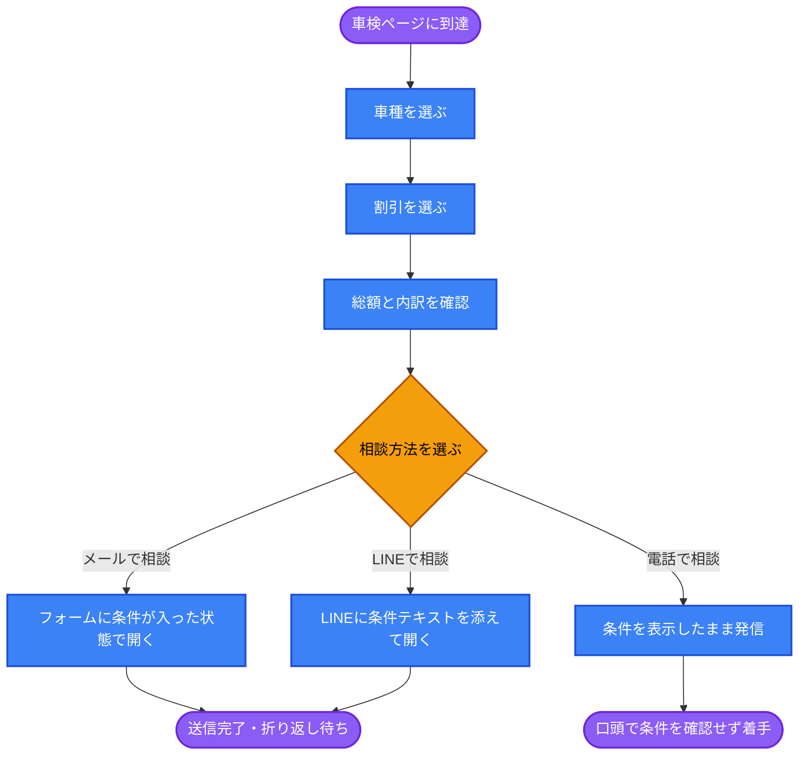
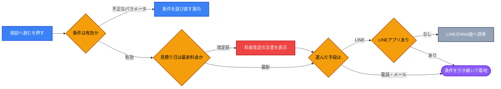

# UX Blueprint: 車検見積りから相談への引き継ぎ

## 1. 🎯 Strategy & Context

### 根本原因（5 Whys）

| # | 問い | 答え |
| --- | --- | --- |
| 1 | なぜ見積り後に相談へ進まないのか | 見積り内容を持ったまま進む手段がないため |
| 2 | なぜ手段がないのか | 最終CTAが `tel:` と LINE の直リンクで、条件を渡していない `[source: app/shaken/ClientPage.tsx:625-629]` |
| 3 | なぜ渡していないのか | 見積り条件がページ内の state に閉じていたため |
| 4 | なぜ閉じていたのか | 見積りが「参考表示」として作られたため |
| 5 | なぜ参考表示なのか | **シミュレーターが「計算機」として設計され、「相談の入口」として設計されていない** |

**根本原因: 送客の起点ではなく、独立した計算機として設計されている。**

- **Problem Statement**: 車検シミュレーターで車種と割引を確定させたユーザーが、その条件を保持したまま相談に進めない。電話・LINEでは条件を口頭で再説明する必要があり、問い合わせフォームへ移動すると入力がゼロに戻る `[source: app/shaken/ClientPage.tsx:625-629 / app/page.tsx]`
- **User Goal**: 自分の車の車検費用の見当をつけ、**その条件のまま**予約・相談したい `[source: chat-input]`
- **Business Goal**: 見積り完了から相談着手までの離脱を減らす。あわせて、電話応対時の条件ヒアリング時間を短縮する `[source: chat-input]`
- **Success Metrics**:
  - シミュレーター到達 → 相談アクション（発信 / LINE / フォーム送信）の到達率
  - フォーム経由の問い合わせのうち、車種と割引が特定済みで届いた割合
  - 1件あたりの条件ヒアリング所要時間（電話）

### 前提条件（既存資産）

見積り条件のURL同期は実装済み（`/shaken?type=regular&discounts=1,3,5`）`[source: lib/urlState.ts]`。本ブループリントはこの「条件を運べる状態」を前提に、**運んだ先で使う**ことを設計する。

---

## 2. 🛣️ User Flow

**Steps:**

1. 車検ページ到達 → 2. 車種選択 → 3. 割引選択 → 4. 総額確認 → 5. 相談方法の選択 → 6. 条件を引き継いだ状態で着地
   - Branch A（メール）: 条件がフォームに転記済み → 追記して送信
   - Branch B（LINE）: 条件テキストを保持したままトーク画面へ
   - Branch C（電話）: 画面に条件を表示 → そのまま読み上げてもらう

### 構造上の判断と理由

| 判断 | 理由 |
| --- | --- |
| 条件は「URL」ではなく**人間が読めるサマリー**として引き継ぐ | 電話・LINEでは相手が URL を開けない。読み上げ可能な形式が必要 |
| 電話は**条件をそのまま読み上げてもらう** | 控え番号案は不採用。受け手側に番号を照会する仕組みが無く、言われても分からないため（2026-08-21 顧客指摘）。条件は車種と割引の2点で短く、読み上げ可能 |
| フォームは自動入力の上で**編集可能**にする | ユーザーが条件を訂正できる余地を残す（User control and freedom） |
| 概算である旨を引き継ぎ先にも同梱する | 引き継いだ数字が「確定額」として一人歩きするのを防ぐ |

---

## 3. 🏗️ Information Architecture

優先度の高い順に配置する。

- **見積り結果セクション**（最上位）: 総額、内訳、適用中の割引一覧。ユーザーが最も確認したい情報
- **引き継ぎセクション**（結果の直下）: 3つの相談方法。それぞれに「何が引き継がれるか」を明示
  - 各手段の下に引き継ぎ内容のプレビュー（車種 / 割引 / 総額）。電話の場合はこの表示をそのまま読み上げてもらう
- **注記セクション**（最下位）: 概算である旨、追加整備で変動する旨。既存の注記を流用

現状は結果セクションと相談CTAの間に情報の橋渡しがなく、ユーザーが「何を伝えればいいか」を自分で組み立てる必要がある。この橋渡しを IA として明示的に持たせる。

---

## 4. ⚠️ Edge Cases

| State | Trigger | Expected Behavior |
| --- | --- | --- |
| Empty | 割引を1つも選んでいない | 引き継ぎ自体は成立させる。「割引なし」と明示して送る |
| Invalid | 共有URLのパラメータが不正・存在しないID | 既定条件で表示し、条件が復元できなかった旨を結果の近くで知らせる |
| Stale | 料金改定後に古い共有URLで開かれた | 見積り日を併記し、金額が変わる可能性を結果の近くで知らせる。**送信はブロックしない** |
| Error | フォーム送信失敗 | 既存の実装どおり送信ボタン直上にインライン表示し、電話番号という代替手段を併記 `[source: app/page.tsx]` |
| Unavailable | LINE未インストール | LINEのWeb版へ退避。電話・メールも同じ場所に残す |
| Loading | 送信処理中 | 送信ボタンを処理中表示にし、二重送信を防ぐ（既存実装あり） |

---

## 5. 🧠 Heuristics Applied

- **Visibility of system status**: 「何が引き継がれたか」を引き継ぎ前にプレビューする。現状は引き継ぎの有無自体が不可視
- **Recognition rather than recall**: 電話導線でも条件を画面に出したままにする。記憶ではなく画面を見ながら話せる状態にする（Miller's Law）
- **User control and freedom**: 自動入力された条件を編集・削除できる。引き継ぎを拒否する選択肢も残す
- **Consistency and standards**: 現状「お電話で予約」「LINEで予約」「お問い合わせ」の3語が混在している `[source: app/shaken/ClientPage.tsx:575,579 / app/page.tsx]`。同じ行為には同じ語を使う。用語の確定は `ux-writer` に引き継ぐ
- **Error prevention**: 見積り日を条件に含めることで、古い見積りでの来店を事前に検知できる
- **Hick's Law**: 相談方法を3つに固定する。手段を増やすと選択のコストが上がり、結局どれも選ばれない

---

## 6. 📊 Risks & Assumptions

| 種別 | 内容 | 検証方法 |
| --- | --- | --- |
| 仮説 | 見積り後の離脱理由が「引き継ぎの断絶」である | 現状の到達率を先に計測する。実装前にベースラインが必要 |
| 検証済み | 控え番号は不成立 | **受け手側に照会の仕組みが無いため不採用**（2026-08-21）。番号方式を再検討する場合は、まず受付側で番号から条件を引ける手段が前提になる |
| リスク | 概算見積りが「確定金額」と受け取られる | 引き継ぎ先にも概算である旨を必ず同梱する。金額のみを単独で持ち出さない |
| リスク | 自動入力された文面をユーザーが読まずに送信する | 自動入力部分と自由記述部分を視覚的に分離する（UI側の課題として引き継ぐ） |
| 制約 | 現行フォームに電話番号欄がない `[source: app/actions/sendEmail.ts]` | 折り返しがメールのみになる。車検予約では電話折り返しの需要が高く、欄の追加要否を判断する必要がある |

---

## 7. ➡️ Next Steps

- Handoff to: `ui-implementation-specialist`（引き継ぎセクションの配置と自動入力部分の視覚的分離）＋ `ux-writer`（「予約」「相談」「問い合わせ」の用語統一）
- Blocked by:
  - 料金改定日をデータとして持つかの判断（Stale 検知の前提）
  - フォームへの電話番号欄追加の可否

---

## 8. 📂 Source Files Used

- `app/shaken/ClientPage.tsx` — 現行の見積りUI・最終CTA
- `app/actions/sendEmail.ts` — 問い合わせの送信項目
- `app/page.tsx` — 問い合わせフォームのジャンル選択肢とエラー表示
- `lib/urlState.ts` — 見積り条件のURL同期（実装済み）
- chat-input — 本セッションでの依頼内容

> `docs/intent/` `docs/product/` `docs/brand/` `prd.md` は本リポジトリに存在しない。上記の必須3項目はコード実測とセッション入力から導出したもので、事業側の裏取りが未実施である点に留意すること。
