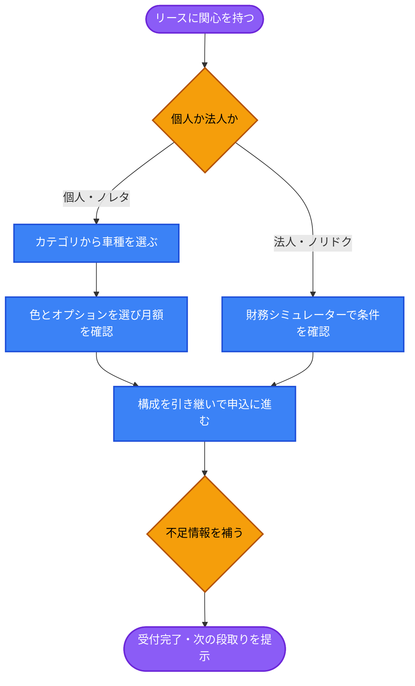
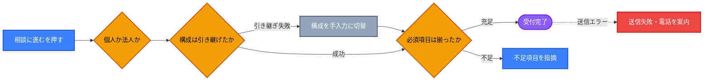

# UX Blueprint: ノレタ／ノリドクの申込フロー

## 1. 🎯 Strategy & Context

### 根本原因（5 Whys）

| # | 問い | 答え |
| --- | --- | --- |
| 1 | なぜ車種を選んだ後に申込が進まないのか | 選んだ内容を持ったまま進む先がないため |
| 2 | なぜ進む先がないのか | 車種ページの最終CTAが `/#contact` へ飛ぶだけ `[source: app/suv/rav4/ClientPage.tsx:299]` |
| 3 | なぜ飛ぶだけなのか | 車種・色・オプションを受け取る器がフォームに無いため `[source: app/actions/sendEmail.ts]` |
| 4 | なぜ器が無いのか | 個人・法人・全問い合わせが単一フォームを共有しているため |
| 5 | なぜ共有しているのか | **リースを「問い合わせの一種」として扱い、独立した申込導線として設計していない** |

**根本原因: 検討の粒度（車種・色・オプションまで選べる）と受け口の粒度（自由記述1つ）が一致していない。**

- **Problem Statement**: 車種ページで色とオプションを選び月額を確定させたユーザーが、その構成を持ったまま申込に進めない。到達先の共通フォームは車種・グレード・オプションを受け取る欄を持たず、自由記述に頼っている `[source: app/suv/rav4/ClientPage.tsx:299 / app/actions/sendEmail.ts]`
- **User Goal**:
  - 個人（ノレタ）: 選んだ構成の月額で本当に契約できるかを確かめ、次の段取りを知りたい
  - 法人（ノリドク）: 財務メリットを自社の条件で確認し、社内稟議に出せる形で見積りを得たい `[source: app/noridoku/ClientPage.tsx]`
- **Business Goal**: 構成が特定された状態で相談が届くことで、初回ヒアリングを省略し見積り提示までの往復を減らす `[source: chat-input]`
- **Success Metrics**:
  - 車種ページ到達 → 申込アクションの到達率
  - 届いた相談のうち、車種・色・オプションが特定済みの割合
  - 初回相談から見積り提示までの往復回数

### 個人と法人を分ける根拠

| | ノレタ（個人） | ノリドク（法人・個人事業主） |
| --- | --- | --- |
| 検討の起点 | 車種を選ぶ | 財務条件を確かめる `[source: app/noridoku/ClientPage.tsx]` |
| 必要情報 | 氏名・連絡先・希望車種 | 上記＋法人名・担当者・事業形態 |
| 意思決定者 | 本人 | 稟議を通す第三者がいる |
| 次の段取り | 審査・納車の説明 | 見積書の発行（社内提出用） |

**同じフォームで受けると、法人には項目が足りず、個人には過剰になる。** 現状のジャンル選択肢は「ノレタ」「ノリドク（法人向けリース）」「リース全般」と3つに分かれているが、選択肢が分かれるだけで入力項目は共通のまま `[source: app/page.tsx]`。

---

## 2. 🛣️ User Flow

**Steps:**

1. リースに関心 → 2. 個人／法人の分岐 → 3. 構成または財務条件の確定 → 4. 構成を引き継いで申込 → 5. 不足情報の補完 → 6. 受付完了
   - Branch A（個人）: カテゴリ → 車種 → 色・オプション → 月額確定 → 申込
   - Branch B（法人）: 財務シミュレーター → 条件確定 → 見積り依頼

### 構造上の判断と理由

| 判断 | 理由 |
| --- | --- |
| 個人と法人で**入力項目を分ける**（画面は分けなくてよい） | 必要情報が異なる。ジャンル選択に応じて項目を出し分けることで、個人に法人項目を見せない |
| 選んだ構成は**要約として提示してから送信**する | 色・オプションは項目数が多く、送信前に本人が確認できないと誤りに気づけない |
| 「申込」ではなく**「相談・見積り依頼」として設計**する | 審査を伴うため、この時点で契約が成立するわけではない。期待値を実態に合わせる |
| 法人には**社内提出を想定した控え**を返す | 意思決定者が別にいる。稟議に持ち込める形が必要 |
| 送信後に**次に何が起きるか**を明示する | 現状は送信後の案内が「折り返します」のみで、審査・納車までの見通しがない |

---

## 3. 🏗️ Information Architecture

### 車種ページ（個人・ノレタ）

- **構成セクション**: 車両画像、ボディカラー、オプション（既存の並びを維持）
- **月額セクション**: 選択に応じて更新される月額（既存の下部固定バーを活かす）
- **申込セクション**（新設）: 選んだ構成の要約 → 相談・見積り依頼への導線
- **前提セクション**: 頭金なし・ボーナス払いなし・契約年数などの条件（既存）

### 申込フォーム（共通の器、項目は出し分け）

- **共通**: 氏名、連絡先（メール／電話）、希望連絡方法、相談内容
- **個人のみ**: 希望車種の構成（自動で引き継ぎ）、希望納車時期
- **法人のみ**: 法人名・屋号、担当者名、事業形態、想定台数、見積書の要否
- **確認**: 送信内容の要約と、送信後に何が起きるかの説明

`Progressive disclosure` に基づき、選択されたジャンルに応じてのみ追加項目を開示する。全項目を常時見せると入力コストが跳ね上がる。

---

## 4. ⚠️ Edge Cases

| State | Trigger | Expected Behavior |
| --- | --- | --- |
| Empty | 車種を選ばず一覧から直接申込 | 構成なしでも受け付ける。「車種未定」として送り、相談で決める前提にする |
| Partial | オプション未選択のまま進む | 標準装備のみの構成として引き継ぐ。未選択であることを要約に明示 |
| Broken | 構成の引き継ぎに失敗 | 手入力に切り替える。**送信自体はブロックしない** |
| Validation | 法人で法人名が未入力 | 該当項目の直下に指摘し、最初の不備項目へフォーカスを移す |
| Error | 送信失敗 | ボタン直上にインライン表示し、電話という代替手段を併記（既存実装に準拠）`[source: app/page.tsx]` |
| Loading | 送信処理中 | 処理中表示にして二重送信を防ぐ（既存実装あり） |
| 期待値のずれ | 審査に落ちる可能性 | 送信前に「審査があること」を明示。送信完了画面でも次の段取りとして再掲 |

---

## 5. 🧠 Heuristics Applied

- **Match between system and the real world**: 「申込」という語は契約成立を想起させる。実態は審査前の相談であり、語と実態を一致させる（用語確定は `ux-writer` へ）
- **Visibility of system status**: 送信後に「いつ・誰から・何が来るか」を提示する。現状は折り返しの約束のみ
- **Progressive disclosure**: 法人項目は法人を選んだときだけ開示する。個人の入力コストを増やさない
- **Recognition rather than recall**: 選んだ色・オプションを要約として再提示する。ユーザーに記憶させない
- **Error prevention**: 送信前の確認要約で、構成の取り違えを送信前に発見できるようにする
- **Miller's Law**: 法人の追加項目は5±2に収める。台数・事業形態・見積書要否など、営業が本当に使う項目に絞る
- **Consistency and standards**: ノレタとノリドクで申込の作法を揃える。分けるのは項目だけにし、体験の型は共通にする

---

## 6. 📊 Risks & Assumptions

| 種別 | 内容 | 検証方法 |
| --- | --- | --- |
| 仮説 | 構成の引き継ぎが無いことが離脱要因である | 車種ページ到達→問い合わせの現状到達率を先に計測する |
| 仮説 | 法人は個人と異なる項目を必要とする | 営業担当への確認が必要。**本ブループリントの法人項目は未検証の推定** |
| リスク | 項目を増やすと個人の完了率が下がる | 出し分けを徹底する。個人の項目数は現状から増やさない |
| リスク | 「申込」と表示すると契約成立と誤認される | 審査前提であることを送信前後で二度明示する |
| 制約 | 現行フォームに電話番号欄がない `[source: app/actions/sendEmail.ts]` | リース相談は電話折り返しの需要が高い。欄の追加が事実上の前提になる |
| 制約 | 車種ページは21ファイルの同一テンプレート | 申込セクションの追加は21箇所への反映が必要。共通化の判断が先に要る |

---

## 7. ➡️ Next Steps

- Handoff to: `ui-implementation-specialist`（構成要約と出し分けの配置）＋ `ux-writer`（「申込／相談／見積り依頼」の用語確定、審査に関する説明文）
- Blocked by:
  - 法人に必要な項目の確定（営業担当への確認）
  - フォームへの電話番号欄追加の可否
  - 車種ページテンプレートの共通化方針（21ファイルの重複）
  - 送信後の実際の業務フロー（誰がいつ折り返すか）の確認

---

## 8. 📂 Source Files Used

- `app/suv/rav4/ClientPage.tsx` — 車種ページの構成と最終CTA（21車種の代表として）
- `app/noreta/ClientPage.tsx` — 個人向けリースの一覧と導線
- `app/noridoku/ClientPage.tsx` — 法人向けリースの構成と財務シミュレーター
- `app/actions/sendEmail.ts` — 問い合わせの送信項目
- `app/page.tsx` — ジャンル選択肢とエラー表示
- chat-input — 本セッションでの依頼内容

> `docs/intent/` `docs/product/` `docs/brand/` `prd.md` は本リポジトリに存在しない。特に**法人（ノリドク）の必要項目は営業実務の裏取りが未実施の推定**であり、confidence を 75% としている。
