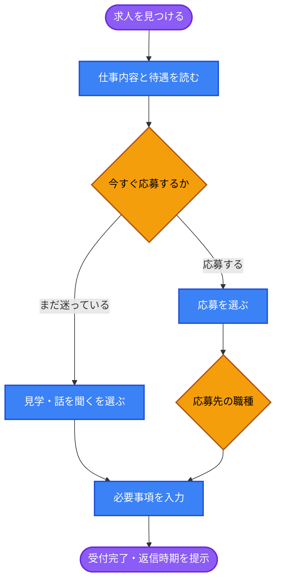
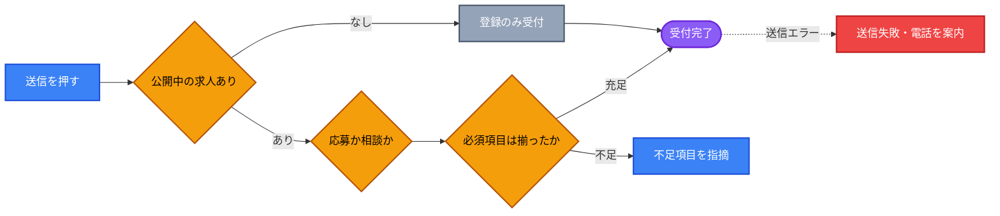

# UX Blueprint: 採用の応募フロー

## 1. 🎯 Strategy & Context

### 根本原因（5 Whys）

| # | 問い | 答え |
| --- | --- | --- |
| 1 | なぜ応募が集まらないのか | 応募の受け口が電話と汎用フォームしかないため `[source: app/recruit/ClientPage.tsx:579]` |
| 2 | なぜ汎用フォームなのか | 採用専用の受け口が作られていないため |
| 3 | なぜ作られていないのか | 採用が「問い合わせの一種」として扱われているため |
| 4 | なぜそう扱われているのか | ジャンル選択肢に採用・応募が存在せず、応募者は「その他」を選ぶしかない `[source: app/page.tsx]` |
| 5 | なぜ存在しないのか | **求人ページと問い合わせ基盤が別々に作られ、接続が設計されていない** |

**根本原因: 応募者は「その他」を選んで自由記述するしかなく、応募の意思表示そのものが構造化されていない。**

- **Problem Statement**: 採用ページの応募CTAは電話と汎用フォームの2つだけで、フォームのジャンル選択肢に採用・応募が存在しない。応募者は「その他」を選び、どの職種に応募するかを自由記述で書く必要がある `[source: app/recruit/ClientPage.tsx:579 / app/page.tsx]`
- **User Goal**:
  - 応募検討者: 職場の実態を知り、負担の少ない方法で最初の接触をしたい
  - ページの文言も「まずは話を聞くだけ」「職場を見てみたい」を歓迎しており、**応募前の段階の受け皿**が想定されている `[source: app/recruit/ClientPage.tsx:571-573]`
- **Business Goal**: 整備士採用の母集団を増やす。応募の心理的ハードルを下げ、電話をかけられない層を取りこぼさない `[source: chat-input]`
- **Success Metrics**:
  - 採用ページ到達 → 接触アクション（発信・フォーム送信）の到達率
  - 届いた連絡のうち、応募か見学かの意図が判別できる割合
  - 「その他」ジャンルで届く採用関連の連絡件数（減るほど良い）

### 現状の構造的な欠陥

| 事実 | 影響 |
| --- | --- |
| ジャンル選択肢に採用・応募が無い `[source: app/page.tsx]` | 応募者が「その他」を選ぶ。**受信側で採用関連が仕分けできない** |
| 送信先が営業と同じアドレス `[source: app/actions/sendEmail.ts]` | 応募が営業の問い合わせに埋もれる |
| フォームに電話番号欄が無い | 採用の連絡は電話が実務的。折り返し手段が限られる |
| 求人データに応募要件・給与・待遇が構造化されている `[source: app/recruit/ClientPage.tsx:26-52]` | **応募前の疑問に答える素材は既にある**。接続すれば活用できる |
| 職種の公開フラグで出し分けている（現在は整備士のみ公開）`[source: app/recruit/ClientPage.tsx:20,56]` | 応募先の選択肢は動的。フォーム側も連動が必要 |

---

## 2. 🛣️ User Flow

**Steps:**

1. 求人を見つける → 2. 内容を読む → 3. 温度感の分岐 → 4. 職種の特定 → 5. 入力 → 6. 受付完了
   - Branch A（応募）: 職種を選び、応募に必要な項目を入力
   - Branch B（見学・相談）: 職種は任意。連絡先と聞きたいことだけで送れる

### 構造上の判断と理由

| 判断 | 理由 |
| --- | --- |
| **「応募」と「見学・相談」を最初に分岐させる** | ページ自身が「話を聞くだけ」を歓迎している `[source: app/recruit/ClientPage.tsx:571]`。同じ入口に押し込むと、迷っている層が応募の重さに引き返す |
| 見学・相談は**入力項目を最小にする** | 心理的ハードルを下げることが目的。氏名と連絡先だけで成立させる |
| 応募先の職種は**公開中の求人から選ばせる** | 公開フラグで出し分けている以上、非公開職種を選べてはいけない。整合が必要 |
| **履歴書は初回で求めない** | 初回接触で書類を要求すると離脱する。書類は折り返し後の段取りとする |
| 送信先を**営業と分離する**（またはジャンルで仕分ける） | 応募が営業問い合わせに埋もれるのを防ぐ。最低でもジャンル選択肢の追加は必須 |
| 返信の**時期を明示する** | 応募者は複数社に同時応募している。待たせると他社に決まる |

---

## 3. 🏗️ Information Architecture

### 採用ページ

- **求人カード**: 職種名、仕事内容、応募資格、給与、待遇、勤務条件（既存の構造をそのまま活用）`[source: app/recruit/ClientPage.tsx:26-52]`
- **接触セクション**（既存を再構成）: 「応募する」と「まず話を聞く」を並置。現状は電話とフォームという**手段**で分かれているが、**意図**で分けるほうが応募者の判断に合う
- **不安に答えるセクション**: 未経験可・資格支援・残業の実態など、応募前の疑問。既存データに含まれている

### 応募フォーム

- **意図の選択**（最上位）: 応募 / 見学・相談
- **共通**: 氏名、連絡先（電話・メール）、希望連絡方法・時間帯
- **応募のみ**: 応募職種（公開中の求人から選択）、経験の有無、希望する連絡時期
- **見学・相談のみ**: 聞きたいこと（自由記述）
- **確認**: 送信内容と、いつ誰から連絡が来るか

`Progressive disclosure` により、意図の選択に応じてのみ項目を開示する。応募と相談で必要情報が異なるため、共通フォームに全項目を並べると相談側の負担が跳ね上がる。

---

## 4. ⚠️ Edge Cases

| State | Trigger | Expected Behavior |
| --- | --- | --- |
| Empty | 公開中の求人が0件（全職種 `published: false`）`[source: app/recruit/ClientPage.tsx:117]` | 現状はページ全体が「準備中」表示。**連絡手段まで消える**のは機会損失。募集再開時の連絡先登録だけは受け付ける |
| Partial | 職種を選ばず送信 | 見学・相談として受け付ける。応募の場合のみ職種を必須にする |
| Validation | 連絡先が未入力 | 該当項目の直下に指摘し、最初の不備項目へフォーカスを移す |
| Error | 送信失敗 | ボタン直上にインライン表示し、電話番号を併記（既存実装に準拠）`[source: app/page.tsx]` |
| Loading | 送信処理中 | 処理中表示にして二重送信を防ぐ（既存実装あり） |
| 時間外 | 定休日・営業時間外に送信 | 返信が翌営業日以降になる旨を提示。営業カレンダーのデータが既にある `[source: app/page.tsx]` |
| 応募後の無反応 | 数日返信がない | **UI では解決できない運用課題**。返信SLAの設定が前提（下記リスク参照） |

---

## 5. 🧠 Heuristics Applied

- **Match between system and the real world**: ジャンル選択肢に採用が無く「その他」を選ばせる現状は、応募者の意図と選択肢が一致していない。最優先で解消すべき不一致
- **Flexibility and efficiency of use**: 「応募」と「相談」で経路を分け、温度感の異なる利用者を同じ導線に押し込まない
- **Visibility of system status**: いつ誰から返信が来るかを送信前後で提示する。応募者は他社と並行しており、待ち時間が離脱要因になる
- **Progressive disclosure**: 意図の選択に応じて項目を開示し、相談側の入力負担を最小に保つ
- **Error prevention**: 応募職種を公開中の求人から選ばせることで、募集していない職種への応募を発生させない
- **Hick's Law**: 初回の選択肢を「応募」「相談」の2つに絞る。手段（電話／メール／LINE）は意図を選んだ後に提示する
- **Recognition rather than recall**: 求人カードから応募に進んだ場合、職種を選び直させない

---

## 6. 📊 Risks & Assumptions

| 種別 | 内容 | 検証方法 |
| --- | --- | --- |
| 仮説 | 応募の障壁が「受け口の不在」である | 現状の応募経路別の件数を確認する。**実データ未確認** |
| 仮説 | 「まず話を聞く」需要が実在する | ページ文言がそう想定しているだけで、実績は未確認 `[source: app/recruit/ClientPage.tsx:571]` |
| リスク | 応募が営業問い合わせに埋もれる | 送信先の分離、または件名でのジャンル明示が前提。**現状は同一アドレス** `[source: app/actions/sendEmail.ts]` |
| リスク | 返信が遅れて他社に決まる | 返信SLAを決めないと、導線を整えても成果に結びつかない。**運用側の合意が必要** |
| リスク | 個人情報の取り扱い | 応募情報は営業の問い合わせより機微。フッターのプライバシーポリシーは現在リンク先が未設定（`href="#"`）`[source: app/page.tsx]`。**応募受付の前に整備が必要** |
| 制約 | フォームに電話番号欄がない `[source: app/actions/sendEmail.ts]` | 採用の連絡は電話が実務的。欄の追加が事実上の前提 |
| 制約 | 求人が0件のとき採用ページ全体が準備中表示になる | 連絡手段まで消える現在の挙動は、募集再開前の関心層を取り逃す |

---

## 7. ➡️ Next Steps

- Handoff to: `ui-implementation-specialist`（意図の分岐と出し分けの配置）＋ `ux-writer`（「応募」「見学」「相談」の用語確定、返信時期の伝え方）
- Blocked by:
  - **ジャンル選択肢への採用・応募の追加**（最小の修正で最大の効果。単独で先行実施可能）
  - 応募の送信先を営業と分けるかの判断
  - 返信SLAの決定（運用側の合意）
  - プライバシーポリシーの整備（応募受付の前提条件）
  - フォームへの電話番号欄追加の可否

---

## 8. 📂 Source Files Used

- `app/recruit/ClientPage.tsx` — 求人データ構造、公開フラグ、応募CTA、ページ文言
- `app/page.tsx` — 問い合わせフォームのジャンル選択肢、営業カレンダー、フッターのポリシーリンク
- `app/actions/sendEmail.ts` — 問い合わせの送信項目と送信先
- chat-input — 本セッションでの依頼内容

> `docs/intent/` `docs/product/` `docs/brand/` `prd.md` は本リポジトリに存在しない。**応募の実績データ・返信の運用実態はいずれも未確認**であり、confidence を 70% としている。3件のうち最も裏取りが必要なブループリント。
